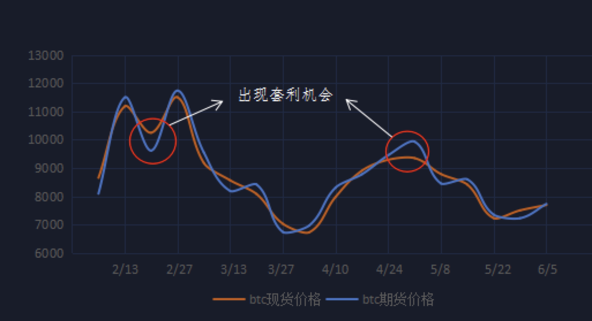

# 期现套利策略

## 策略说明

期现套利是指利用期货市场和现货市场之间的差价，**在价格低的市场买入或做多，同时在价格高的市场卖出或者做空**，**等到差价消失时平仓从而获利的行为**。

由于期货合约交割机制的存在，同一数字货币的价格在现货市场和期货市场紧密相连，期货价格最迟在合约到期日会和现货价格趋同，所以当期货合约和现货之间存在价差的时候，就可以进行无风险套利。

合约价格一定程度反映市场对于标的未来价格的预期。当出现剧烈行情时，合约价格将会与现货价格出现较大偏离，产生基差。本策略的核心逻辑为现货与合约之间基差的回归存在套利机会。合约价格在临近交割会趋近于现货价格；另一方面，基差也可能在市场波动率减小的过程中恢复到正常水平。

举个例子，我们来看看具体怎么操作，**假设我们现在零手续费**：

5月1日比特币期货价格为9925美元/枚，现货价格为9345美元/枚，基差为580美元/枚。

至5月15日，比特币期货价格为8590美元/枚，当日现货价格为8410美元/枚，基差缩小到180美元/枚。

如在5月1日，以9925美元/枚的价格卖出开空价值1枚比特币期货的合约，同时以9345美元/枚的价格买入一枚比特币现货。

在5月15日时，对期货进行平仓，同时以8410美元/枚的价格卖出比特币。

此次期现套利组合盈利就是580-180=400，也就是每手期货保守盈利400点，折算成现货每枚比特币增加盈利400美元。  

策略相当于“**在现货市场进货，在期货市场交割卖出**”，投资者所获得的单位利润为，当时期货价格与现货价格的价差减去持有成本和交割成本。

此外，我们可以将策略**高频化**，因为如果我们在期现套利时始终等到交割时才进行平仓获利，我们的交易次数会很少，整体的收益会比较偏低。

**通过对现货和期货价格的监控，我们可以发现两者价格曲线时互相交错的，所以我们只需要在有价差时建仓，在价格相等时平仓从而获利，等到再次出现价差时再次建仓，不断循环，不需要等到交割时再平仓，这样就可以大大提高交易频率，从而提高整体收益**。

**期现套利主要包括正向基差套利和反向基差套利**。

也就是说当现货价格被低估，期货合约价格被高估时，你可以卖出该期货合约，同时买入同等数量的现货，建立套利头寸。当现货和期货价格差距趋于正常时，将期货合约平仓，同时卖出对应现货，从中获得利润。

相反，当现货价格被高估，期货合约价格被低估时，投资者可以买入该期货合约，同时卖出同等数量现货，建立套利头寸。当现货和期货价格趋于正常时，同时平仓，获利了结，这是反向基差套利。

**期现套利对期货市场有非常重要的作用**：

1. 正因为期货与现货之间可以套利，期货的价格才不会脱离现货价格而出现离谱的价格，使得数字货币的价格更合理，更能反应市场的走势。
2. 套利行为有助于市场流动性的提高，更有利于投资者交易和套期保值操作的顺利进行。

比特币现货价格跌宕起伏，与期货间的基差经常出现较大偏离。如果你能掌握期现套利的方法，抓住这些机会，那一定可以收获可观的利润。

**但是，在实操过程中，手续费是不可忽视的，而且需要开的合约张数也未必刚好是整数**。因此，由于这些误差，期现套利的收益会产生一些波动。在价格急剧波动的时候，收益波动也会比较大。

**此外，KuCoin拥有level3级别的交易数据、极优的撮合引擎，以及对api用户提供特别的手续费折扣，极大程度的减少了你在策略实施时的劣势，同时提供sandbox环境作为数据测试支撑，帮助你规避风险。**  

**这里仅提供一个简单且不完备的交易策略，所以在使用时请注意规避风险，当然，我们不希望你出现较多的亏损，所以在未经自己亲手测试之前，请千万不要直接在实际环境使用，我们也不想你成为一个慈善家！！！**

**如果你想在实际环境中利用策略获得稳定的盈利，我们希望你能够在sandbox环境配合其他参数或是策略进行测试调整，以使你能够达到目的，我们也非常期待你能分享你的测试数据以及独到的见解。**

**当然，如果这个过程中，你遇到任何问题需要帮助亦或是有赚钱的策略想要分享，请在ISSUE中反映，我们会努力及时响应。**

**如果你对该策略有兴趣，请点击右上角star，我们会根据star个数来衡量策略的受欢迎程度和后续优化优先级，你也可以点击右上角watching通过接收更新通知来持续关注该项目**。

